- [12.07] Visualization of corresponding OSM tile and pc bev img.

seq 00 index 900

  
  

seq 01 index 800

  
  

seq 02 index 699

  
  

seq 04 index 238

  
  

seq 05 index 1028

  
  

seq 06 index 467

  
  

seq 07 index 66

  
  

seq 08 index 1404

  
  

seq 09 index 533

  
  

seq 10 index 842

  
  

- [11.29] The trajectory of point cloud and canvas of osm at the tile manager coordinate system to check the correction of transformation in dataloader.
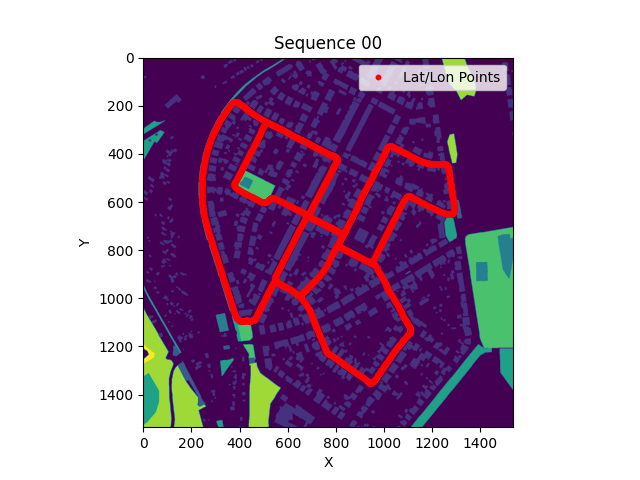
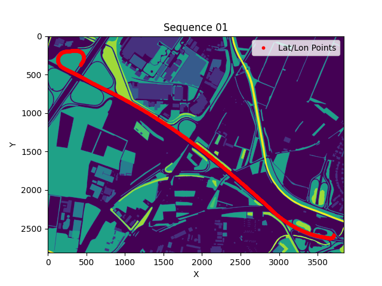
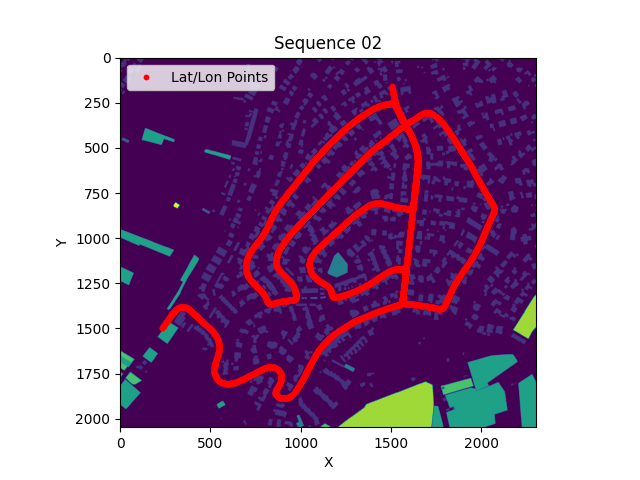
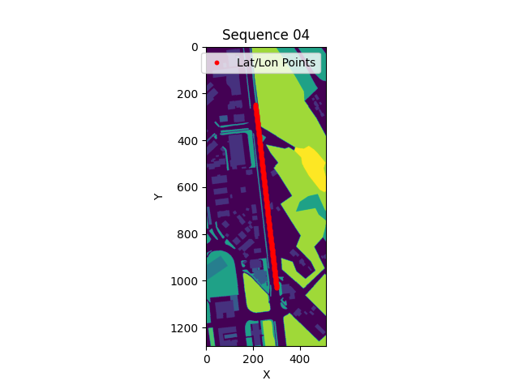
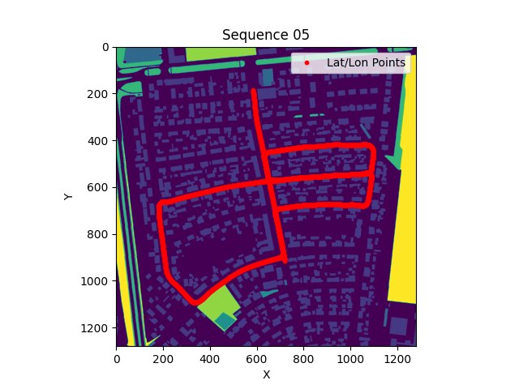
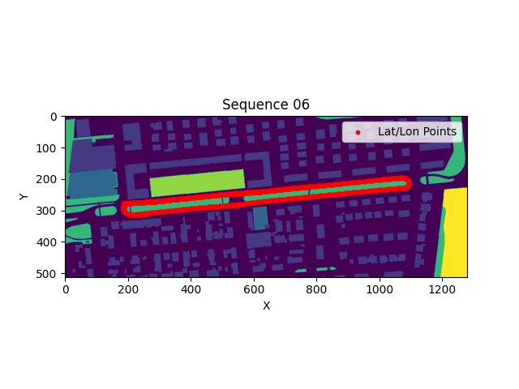
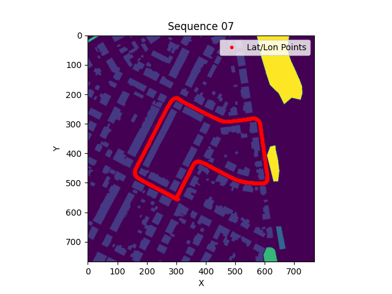
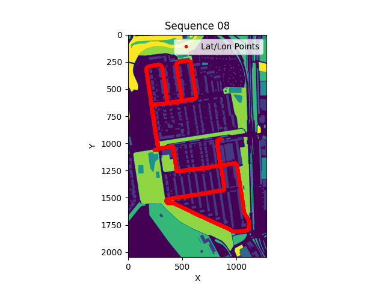
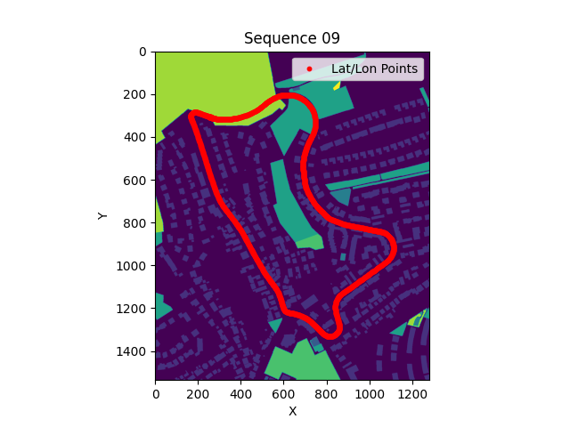
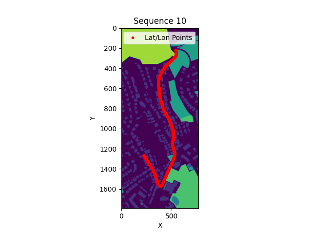

- [11.07] KITTI Odometry Dataset with OSM Visualization has been checked.
Sequence 03 was deleted in KITTI raw data.

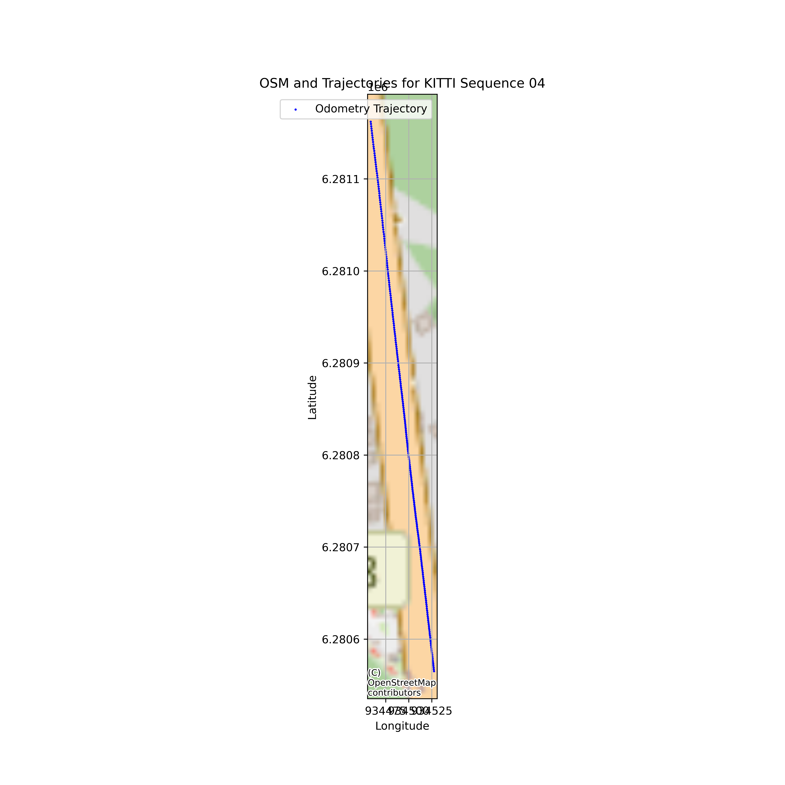

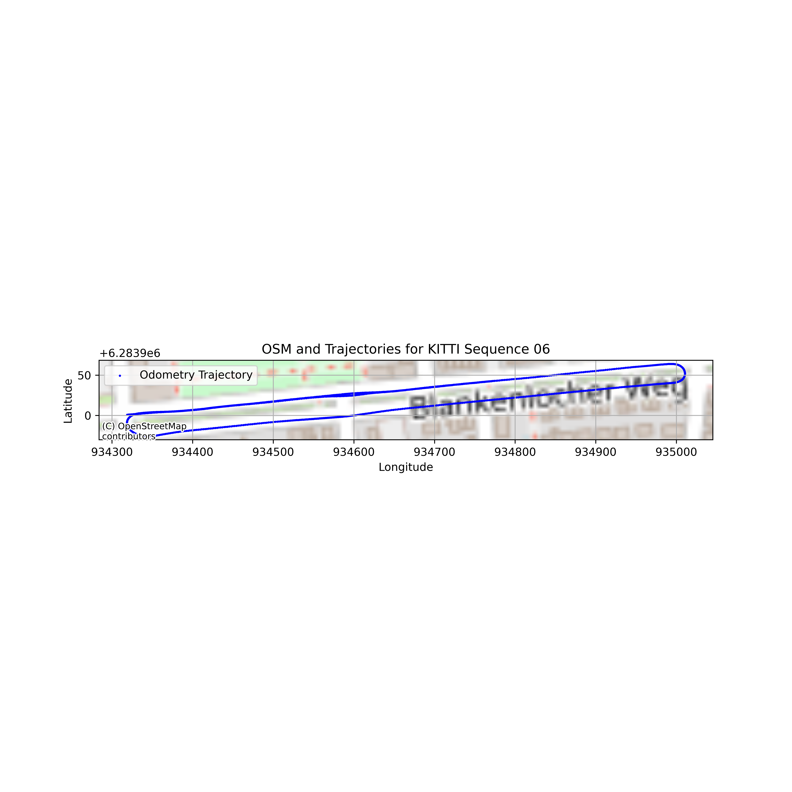

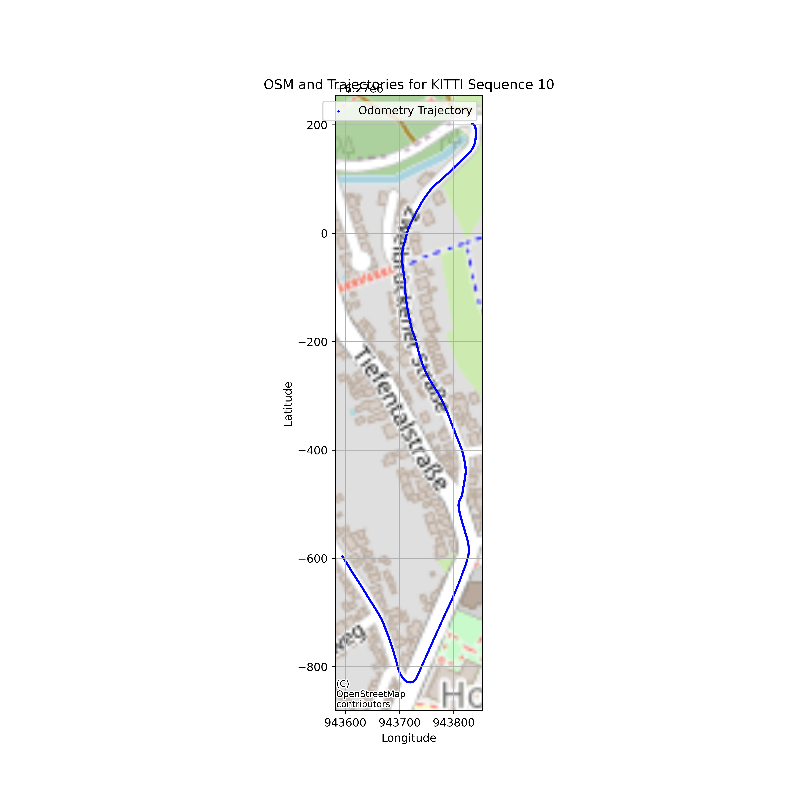