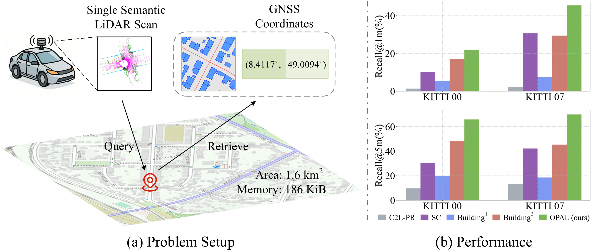

<h2> 
OPAL: Visibility-aware LiDAR-to-OpenStreetMap Place Recognition via Adaptive Radial Fusion</a>
</h2>

This is the official PyTorch implementation of the following publication:

> **OPAL: Visibility-aware LiDAR-to-OpenStreetMap Place Recognition via Adaptive Radial Fusion**<br/>
> [Shuhao Kang*](https://kang-1-2-3.github.io/), [Youqi Liao*](https://martin-liao.github.io/), [Yan Xia†](https://yan-xia.github.io/), [Olaf Wysocki](https://www.asg.ed.tum.de/en/pf/team/olaf-wysocki/), [Boris Jutzi](https://www.professoren.tum.de/en/jutzi-boris), [Daniel Cremers](https://cvg.cit.tum.de/members/cremers)<br/>
> *CoRL 2025*<br/>
> **Paper** | [**Arxiv**](https://arxiv.org/abs/2504.19258) | [**Project-page**](https://kang-1-2-3.github.io/OPAL/)


## 🔭 Introduction
<p align="center">
<strong>TL;DR: OPAL is a framework for point cloud localization in OpenStreetMap.</strong>
</p>


<p align="justify">
<strong>Abstract:</strong> 
LiDAR place recognition is a critical capability for autonomous navigation and cross-modal localization in large-scale outdoor environments. Existing approaches predominantly depend on pre-built 3D dense maps or aerial imagery, which impose significant storage overhead and lack real-time adaptability. In this paper, we propose <strong>OPAL</strong>, a novel framework for LiDAR place recognition that leverages OpenStreetMap (OSM) as a lightweight and up-to-date prior. Our key innovation lies in bridging the domain disparity between sparse LiDAR scans and structured OSM data through two carefully designed components. First, a cross-modal visibility mask that identifies observable regions from both modalities to guide feature alignment. Second, an adaptive radial fusion module that dynamically consolidates radial features into discriminative global descriptors. Extensive experiments on KITTI and KITTI-360 datasets demonstrate OPAL’s superiority, achieving <strong>15.98%</strong> higher recall at <strong>1&nbsp;m</strong> threshold for top-1 retrieved matches, along with <strong>12&times;</strong> faster inference speed compared to the state-of-the-art approach.
</p>


## 💻 Installation
```bash
pip install -r requirements.txt
```

## 🚅 Usage
### Semantic label preparation
Please download the semantic labels for KITTI and KITTI-360, which are generated using Cylinder3D, as well as the pretrained checkpoint file and karlsruhe.osm from [Google Drive](https://drive.google.com/drive/folders/1cZpX56AXcngHXHq7QACf8A_NXLcGnZQ2?usp=sharing). 

Note: We have already prepared the processed OSM tiles in the data/ directory, so downloading the original OSM data of Karlsruhe is not required. However, if needed, you may re-generate them during training or testing.

After downloading, place the checkpoint file into the directory:
```
checkpoints/
```

### KITTI data preparation
Download KITTI Odometry point cloud data from [KITTI website](https://www.cvlibs.net/datasets/kitti/eval_odometry.php).

After extracting point clouds and labels, your layout should look like:
```
data_odometry_velodyne/dataset/sequences
│
├── 00
│   ├── pred_labels
│   └── velodyne
├── 01
│
├── ...
│
└── 10
```


Note: The KITTI raw dataset provides odometry data with GPS information. Since sequence 03 lacks GPS data, it is excluded from both training and evaluation.


### KITTI-360 data preperation
Download KITTI-360 point cloud data from [KITTI-360 website](https://www.cvlibs.net/datasets/kitti-360/index.php)

After extracting:

```
KITTI360/data_3d_raw
│
├── 2013_05_28_drive_0000_sync
│   └── velodyne_points
│       └── data
│           └── *.bin
├── 2013_05_28_drive_0000_sync_pred
│   └── *.label
├── 2013_05_28_drive_0005_sync
├── ...
├── 2013_05_28_drive_0009_sync
└── 2013_05_28_drive_0009_sync_pred
```


### Evaluation

Evaluate on KITTI dataset
```bash
python test_kitti.py --seq "00"
```

Evaluate on KITTI-360 dataset
```bash
python test_kitti360.py --seq "2013_05_28_drive_0000_sync"
```
### Training
```bash
python train.py
```

## 💡 Citation
If you find this repo helpful, please give us a star~.Please consider citing OPAL if this program benefits your project.
```
@article{kang2025opal,
  title={Opal: Visibility-aware lidar-to-openstreetmap place recognition via adaptive radial fusion},
  author={Kang, Shuhao and Liao, Martin Y and Xia, Yan and Wysocki, Olaf and Jutzi, Boris and Cremers, Daniel},
  journal={arXiv preprint arXiv:2504.19258},
  year={2025}
}
```

We thank [OrienterNet](https://github.com/facebookresearch/OrienterNet), [PolarNet](https://github.com/edwardzhou130/PolarSeg), [BoQ](https://github.com/amaralibey/Bag-of-Queries) for their code implementation.